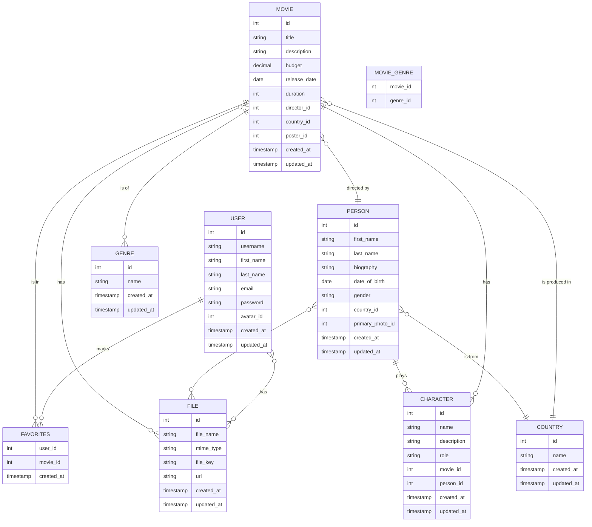

# Movie Application Database

## Project Description

This project involves designing a simplified database for a movie application. The database structure includes tables for users, movies, characters, genres, and more.

## Database Schema

### ER Diagram

